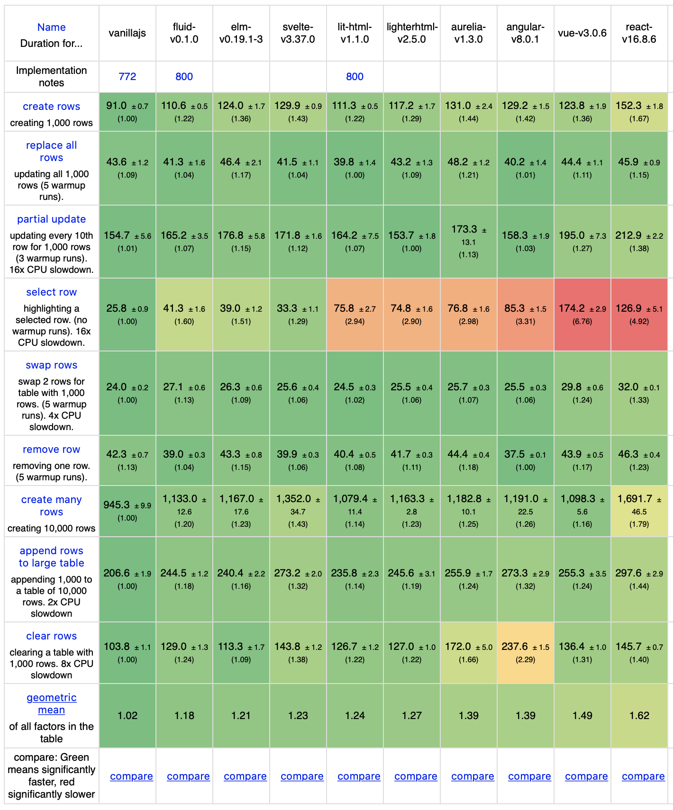

# Fluid 💧

Fluid is an user interface library for the web.

- **Simple:** Tiny API with **only two functions**, `html` and `render`
- **Lightweight:** Only **1.5 KB** minified and gzipped
- **Friendly:** No compilation or build step needed, **just import and run**
- **Blazing Fast:** Updates only what has changed **without virtual DOM**
- **Flexible:** No assumptions about anything, **just a simple library**
- **Declarative:** Just **render everything** when changes occur, no painful updates

## Installation

Install Fluid directly from NPM with `npm install @hereiskevin/fluid` or just try it out on [CodeSandbox](https://codesandbox.io/s/fluid-playground-xfmsp). Fluid is only distributed as an ECMAScript module.

If you're feeling ambitions, you can build Fluid from source.

```bash
$ git clone https://github.com/HereIsKevin/fluid.git
$ npm install
$ npm run build
```

That's it. You should now find your build in the `dist` folder.

## API

Fluid has a tiny API with only two exported functions, `html` and `render`.

### `html(strings, ...values)`

Create a new template for Fluid. Once rendered, the types of each of the interpolated values may not change.

#### Arguments

- `strings: TemplateStringsArray`: Static strings in template
- `values: unknown[]`: Dynamically changing values

#### Returns

- `Template`: Generated template

#### Example

```javascript
const inner = (hidden, style) =>
  html`
    <div hidden?="${hidden}" style="${style}">
      By adding "?" to the end of an attribute, it is toggled whenever its value
      is true. Attributes can be interpolated with "${value}".
    </div>
  `;

const template = (inner) =>
  html`
    <div @click="${() => alert("Event!")}">
      ${inner} By adding "@" to the beginning of an attribute, its value is set
      to be the event handler for the event name in the attribute. Strings,
      templates, or arrays of templates can be interpolated within elements.
      Strings are interpolated as text nodes. Templates are directly inserted
      and are removed when their static strings change. Arrays of templates are
      also directly inserted, but their static strings MAY NOT change.
    </div>
  `;
```

### `render(target, template)`

Render and update templates created by Fluid to the target.

#### Arguments

- `target: Element`: Target for rendering
- `template: Template`: Template to be rendered

#### Example

```javascript
let hidden = false;
let style = "color: red";

const target = document.getElementById("view");
const update = () => render(target, template(inner(hidden, style)));

update();
```

### `Template`

Templates are generated by `html`. All exposed APIs on templates are **subject to change** and **should not be used**. Templates are considered "private" and are not truly part of the public API.

## How It Works

1. When `html` is called, it creates a `Template`, which stores all the parameters without doing anything. This makes repetitive rendering calls very cheap.
2. When a `Template` object is passed to `render`, `render` will attempt to find an already compiled template. If it cannot, then it will compile the template.
3. Compiling templates involves using comment markers for interpolated values, then caching all the places where changes can occur.
4. If the template compiler can find an already-compiled template, it makes a clone of it. Otherwise, it compiles the template.
5. `render` then recursively calls itself to insert or update the compiled templates. Since it already knows where all the changes will occur, updates are fast and inexpensive, unlike virtual DOM, which needs to rebuild and diff the whole tree every render.

## Benchmarks

Fluid is the fastest library of its kind, even faster than hyperHTML and lit-HTML. For the source of the benchmarks, see my fork of [js-framework-benchmark](https://github.com/HereIsKevin/js-framework-benchmark).



## Support

Fluid is made by one developer, me ([@HereIsKevin](https://github.com/HereIsKevin)). Creating a high quality framework is time-consuming. If you find Fluid helpful, please give it a ⭐️ to show your support.

## License

[MIT](https://github.com/HereIsKevin/fluid/blob/master/LICENSE)
