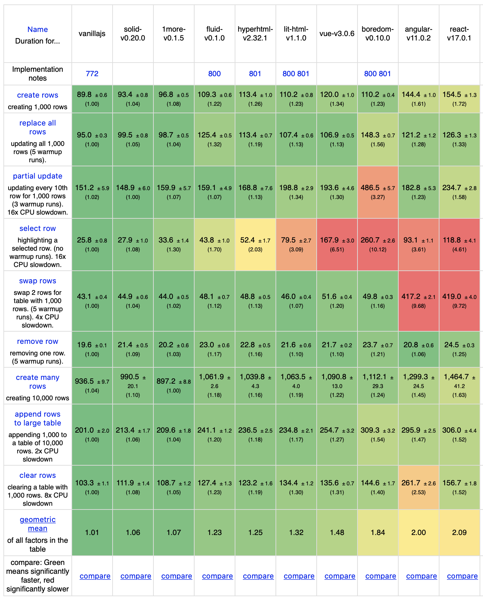

# Fluid 💧

Fluid is an user interface library for the web.

- **Simple:** Tiny API with **only two functions**, `html` and `render`
- **Lightweight:** Under **2 KB** minified and gzipped
- **Friendly:** No compilation or build step needed, **just import and run**
- **Blazing Fast:** Updates only what has changed **without virtual DOM**
- **Flexible:** No assumptions about anything, **just a simple library**
- **Declarative:** Just **render everything** when changes occur, no painful updates

## Installation

Install Fluid directly from NPM with `npm install @hereiskevin/fluid` or just try it out on [CodeSandbox](https://codesandbox.io/s/fluid-playground-xfmsp). Fluid is only distributed as an ECMAScript module.

If you're feeling ambitions, you can build Fluid from source.

```bash
$ git clone https://github.com/HereIsKevin/fluid.git
$ npm install
$ npm run build
```

That's it. You should now find your build in the `dist` folder.

## API

Fluid has a tiny API with only two exported functions, `html` and `render`.

### `html(strings, ...values)`

Create a new template for Fluid. Once rendered, the types of each of the interpolated values may not change. Note that this caveat applies to **all templates with identical strings**.

#### Arguments

- `strings: TemplateStringsArray`: Static strings in template
- `values: unknown[]`: Dynamically changing values

#### Returns

- `Template`: Generated template

#### Example

```javascript
const inner = (hidden, style) =>
  html`
    <div hidden?="${hidden}" style="${style}">
      By adding "?" to the end of an attribute, it is toggled whenever its value
      is true. Attributes can be interpolated with "${value}". Style attributes
      can take an object of properties instead, which will result in style
      diffing. Note that switching between objects and strings for style
      attributes will result in unexpected behavior.
    </div>
    <div ref="${(node) => setValue("paragraph", node)}">
      Reference attributes named "ref" can be used to get references to actual
      nodes. The function passed as the value for the attribute will be called
      when needed with the node passed as an argument.
    </div>
    <div>
      <input .value="${value}" />
      By adding "." to the beginning of an attribute, the property on the
      element will be set to the passed value.
    </div>
  `;

const template = (inner) =>
  html`
    ${inner}
    <div @click="${() => alert("Event!")}">
      By adding "@" to the beginning of an attribute, its value is set to be the
      event handler for the event name in the attribute. Strings or templates
      can be interpolated within elements. Strings are interpolated as text
      nodes. Templates are directly inserted and are removed when their static
      strings change.
    </div>
    ${values.map((value) => inner(value.hidden, value.style))}
    <div>
      Arrays of templates can also be interpolated. When rendered, they will be
      rendered as non-keyed, meaning that Fluid is free to reuse and move
      templates around. This is not suggested for stateful elements like input
      elements. Most of the time, this is going to be faster, but it will be
      slower for removals or insertions in between existing templates.
    </div>
    ${values.map((value) => [value.id, inner(value.hidden, value.style)])}
    <div>
      Arrays of keys with templates can also be interpolated. When rendered,
      they will be rendered as keyed, meaning that Fluid will reorder and move
      elements based on their keys. This is suggested for stateful elements like
      input. This will be faster for removals and insertions in between existing
      templates and slightly slower for most other things.
    </div>
  `;
```

### `render(target, template)`

Render and update templates created by Fluid to the target.

#### Arguments

- `target: Element`: Target for rendering
- `template: Template`: Template to be rendered

#### Example

```javascript
let hidden = false;
let style = "color: red";

const target = document.getElementById("view");
const update = () => render(target, template(inner(hidden, style)));

update();
```

### `Template`

Templates are generated by `html`. All exposed APIs on templates are **subject to change** and **should not be used**. Templates are considered "private" and are not truly part of the public API.

## How It Works

1. When `html` is called, it creates a `Template`, which stores all the parameters without doing anything. This makes repetitive rendering calls very cheap.
2. When a `Template` object is passed to `render`, `render` will attempt to find an already compiled template. If it cannot, then it will compile the template.
3. Compiling templates involves using comment markers for interpolated values, then creating base updaters for each possible change.
4. If the template compiler can find an already-compiled template, it makes a clone of it and binds the updaters. Otherwise, it compiles the template first.
5. `render` then calls the updaters to insert or update the compiled templates. Since it already knows where all the changes will occur, updates are fast and inexpensive, unlike virtual DOM, which needs to rebuild and diff the whole tree every render.

## Benchmarks

Fluid is the fastest library of its kind, even faster than lighterhtml and lit-HTML. For the source of the benchmarks, see my fork of [js-framework-benchmark](https://github.com/HereIsKevin/js-framework-benchmark).

### Non-Keyed

<p align="center">
  
</p>

### Keyed

<p align="center">
  
</p>

## Support

Fluid is made by one developer, me ([@HereIsKevin](https://github.com/HereIsKevin)). Creating a high quality framework is time-consuming. If you find Fluid helpful, please give it a ⭐️ to show your support.

## License

[MIT](https://github.com/HereIsKevin/fluid/blob/master/LICENSE)
